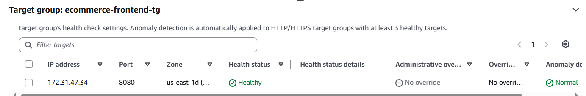
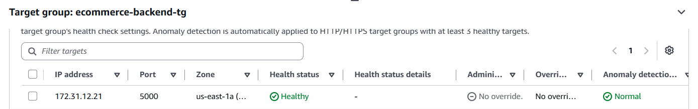

Task 19: Deploy E-Commerce Application on AWS ECS Using Fargate
1. Project Overview
Project: E-Commerce Web Application
Architecture: MERN Stack
Cloud Platform: Amazon Web Services (AWS)
Deployment Service: Amazon ECS with AWS Fargate
Container Registry: Amazon ECR
Load Balancer: Application Load Balancer (ALB)
AWS Region: us-east-1 (N. Virginia)
ECS Cluster: ecommerce-cluster
The objective of Task 19 was to deploy a Dockerized E-Commerce application on Amazon ECS using AWS Fargate.
The application consists of a React frontend, Node.js/Express backend, and MongoDB database.
The task focused on pushing Docker images to Amazon ECR, configuring ECS task definitions and services, setting up an Application Load Balancer, configuring target groups, and troubleshooting deployment issues.
2. Technology Stack
- Frontend: React.js
- Backend: Node.js and Express.js
- Database: MongoDB
- Containerization: Docker
- Container Registry: Amazon ECR
- Container Orchestration: Amazon ECS
- Compute Platform: AWS Fargate
- Load Balancing: Application Load Balancer (ALB)
- Networking: VPC, Security Groups, Target Groups
- Operating System: Ubuntu Linux on AWS EC2
- Cloud Platform: AWS
3. Application Architecture
The E-Commerce application was deployed using Amazon ECS Fargate.
Architecture Flow
                  Internet
                     |
                     v
          Application Load Balancer
                ecommerce-alb
                     |
             HTTP Listener :80
                     |
           +---------+---------+
           |                   |
           v                   v
    Frontend Target       Backend Target
        Group                 Group
           |                   |
           v                   v
    Frontend ECS          Backend ECS
       Service              Service
           |                   |
           v                   v
    React + Nginx         Node.js API
       Port 8080           Port 5000
                               |
                               v
                            MongoDB
                           Port 27017
                         (Sidecar Container)

The Application Load Balancer routes frontend traffic to the frontend ECS service and backend health-check traffic to the backend ECS service.
MongoDB runs as a sidecar container within the backend ECS task.
4. Amazon ECR Repository Configuration
Amazon Elastic Container Registry (ECR) was used to store Docker images.
ECR Repositories Created
Repository	Purpose
frontend	React frontend Docker image
backend	Node.js backend Docker image
mongodb	MongoDB Docker image
Authenticate Docker with Amazon ECR
aws ecr get-login-password --region us-east-1 \
| docker login --username AWS \
--password-stdin <AWS_ACCOUNT_ID>.dkr.ecr.us-east-1.amazonaws.com

Build Docker Images
docker build -t frontend ./frontend

docker build -t backend ./backend

Tag Docker Images
docker tag frontend:latest \
<AWS_ACCOUNT_ID>.dkr.ecr.us-east-1.amazonaws.com/frontend:latest

docker tag backend:latest \
<AWS_ACCOUNT_ID>.dkr.ecr.us-east-1.amazonaws.com/backend:latest

Push Docker Images to ECR
docker push \
<AWS_ACCOUNT_ID>.dkr.ecr.us-east-1.amazonaws.com/frontend:latest

docker push \
<AWS_ACCOUNT_ID>.dkr.ecr.us-east-1.amazonaws.com/backend:latest

MongoDB image was also uploaded to its ECR repository.
Result: Frontend, backend, and MongoDB images were successfully stored in Amazon ECR.
5. Amazon ECS Cluster Configuration
An Amazon ECS cluster was created to manage the containerized application.
Cluster Details
Configuration	Value
Cluster Name	ecommerce-cluster
Launch Type	AWS Fargate
AWS Region	us-east-1
Application	E-Commerce
AWS Fargate was selected to run containers without manually managing EC2 instances for ECS workloads.
Result: The ECS cluster was created successfully.
6. ECS Task Definitions
Two separate ECS task definitions were created for the application.
Frontend Task Definition
Task Definition: ecommerce-frontend
Configuration:
- Launch type: Fargate
- Container: Frontend
- Image source: Amazon ECR
- Application port: 8080
- Web server: Nginx
- Network mode: awsvpc
Backend Task Definition
Task Definition: ecommerce-backend
The backend task definition contains two containers:
Container	Port	Purpose
Backend	5000	Node.js/Express API
MongoDB	27017	Application database
MongoDB was configured as a sidecar container to provide database connectivity for the backend.
MongoDB Environment Variable
MONGO_URI=mongodb://localhost:27017/ecommerce

Because MongoDB and the backend run in the same ECS task, the backend was configured to communicate with MongoDB through localhost.
Result: Both frontend and backend task definitions were successfully registered and became Active.
7. ECS Service Configuration
Two ECS services were created to run the frontend and backend tasks.
ECS Services
Service	Desired Tasks	Running Tasks	Status
ecommerce-frontend-service	1	1	Active
ecommerce-backend-service	1	1	Active
Frontend Service
- Uses the ecommerce-frontend task definition.
- Runs on AWS Fargate.
- Uses port 8080.
- Connected to the frontend target group.
Backend Service
- Uses the ecommerce-backend task definition.
- Runs on AWS Fargate.
- Uses port 5000.
- Connected to the backend target group.
Result: Both ECS services were successfully deployed with one running task each.
8. Application Load Balancer Configuration
An internet-facing Application Load Balancer was configured to distribute incoming application traffic.
ALB Details
Configuration	Value
Load Balancer Name	ecommerce-alb
Load Balancer Type	Application
Scheme	Internet-facing
Listener Protocol	HTTP
Listener Port	80
The ALB was connected to the ECS services through separate target groups.
Target Groups
Target Group	Port	Health Status
ecommerce-frontend-tg	8080	Healthy
ecommerce-backend-tg	5000	Healthy
Result: Both frontend and backend targets became Healthy after resolving configuration issues.
9. ALB Listener Rules
HTTP listener rules were configured to route requests to the appropriate target groups.
Frontend Routing
Default Rule:
HTTP :80
   |
   v
ecommerce-frontend-tg
   |
   v
Frontend Container :8080

The default listener rule forwards application requests to the frontend target group.
Backend Routing
A path-based rule was configured for backend traffic.
/api/*
   |
   v
ecommerce-backend-tg
   |
   v
Backend Container :5000

A separate rule was also configured for the backend health endpoint.
/health
   |
   v
ecommerce-backend-tg

Important: The /api/* listener rule forwards the original URL path to the backend. The application's API routes were not configured with an /api prefix, so /api/health returned 404. The separate /health rule was used for successful backend verification.
10. Security Group Configuration
Security groups were configured to control communication between the Application Load Balancer and ECS tasks.
ALB Security Group
Security Group: ecommerce-alb-sg
The Application Load Balancer was configured to accept incoming HTTP traffic on port 80.
Frontend ECS Security Group
The frontend ECS task required inbound access on port 8080 from the ALB security group.
Backend ECS Security Group
The backend ECS task required inbound access on port 5000 from the load balancer.
Security Group Issue
Initially, the ALB was attached to the default VPC security group instead of ecommerce-alb-sg.
The frontend ECS security group allowed traffic from ecommerce-alb-sg.
Because the ALB was using a different security group, frontend health checks failed.
Solution
Updated the ALB security group configuration and attached the correct ecommerce-alb-sg.
Result: Frontend health checks started passing and the target became Healthy.
11. Backend and MongoDB Connectivity
During deployment, the backend initially failed to connect to MongoDB.
Error
ECONNREFUSED localhost:27017

Root Cause
The backend attempted to connect to MongoDB, but MongoDB was not running inside the backend task.
Solution
Added MongoDB as a sidecar container in the backend ECS task definition.
The backend and MongoDB containers were configured to run within the same ECS task.
MongoDB Connection URI
mongodb://localhost:27017/ecommerce

Result: The backend task was updated to include the MongoDB sidecar container, resolving the missing local database service configuration.
12. Backend Health Check Configuration
The backend application includes a health-check endpoint.
Health Check Endpoint
GET /health

The backend health endpoint was updated to return an HTTP 200 response.
Successful Response
{
  "status": "ok"
}

Verification
curl http://<ALB_DNS_NAME>/health

Result: The backend health endpoint returned the expected JSON response through the Application Load Balancer.
Note: This endpoint verifies that the backend HTTP server responds. It does not independently verify MongoDB connectivity.
13. Docker Image Update and ECS Redeployment
After modifying the backend health-check endpoint, the backend Docker image was rebuilt and pushed to Amazon ECR.
Rebuild Backend Image
docker build -t backend ./backend

Tag Updated Image
docker tag backend:latest \
<AWS_ACCOUNT_ID>.dkr.ecr.us-east-1.amazonaws.com/backend:latest

Push Updated Image
docker push \
<AWS_ACCOUNT_ID>.dkr.ecr.us-east-1.amazonaws.com/backend:latest

Force ECS Service Redeployment
aws ecs update-service \
  --cluster ecommerce-cluster \
  --service ecommerce-backend-service \
  --force-new-deployment \
  --region us-east-1

Result: The updated backend image was deployed through ECS and the backend target group became Healthy.
14. Troubleshooting
Issue 1: Frontend Target Group Unhealthy
Problem: The frontend target group initially failed health checks.
Root Cause: The Application Load Balancer was using the wrong security group.
Solution: Attached ecommerce-alb-sg to the ALB.
Result: The frontend target became Healthy.
Issue 2: Backend Service Attached to Wrong Target Group
Problem: The backend ECS service was initially associated with the frontend target group.
Root Cause: Incorrect target group selection during ECS service configuration.
Solution: Updated the backend service to use:
ecommerce-backend-tg

Result: The backend service was associated with its correct target group.
Issue 3: MongoDB Connection Refused
Error:
ECONNREFUSED localhost:27017

Root Cause: MongoDB was not available within the backend task.
Solution: Added a MongoDB sidecar container to the backend task definition.
Result: The backend task included the required database container.
Issue 4: Backend Health Check Returning 503
Problem: The backend health endpoint returned HTTP 503 when MongoDB was disconnected.
Root Cause: The health-check response depended on database connectivity.
Solution: Updated the backend /health endpoint to return HTTP 200 with:
{
  "status": "ok"
}

Rebuilt the backend Docker image, pushed it to ECR, and forced a new ECS deployment.
Result: The backend target became Healthy.
Issue 5: /api/health Returning 404
Problem: Accessing /api/health through the ALB returned HTTP 404.
Root Cause: The backend application did not have a matching /api/health route.
Solution: Added a separate ALB listener rule for /health.
Result: The backend health endpoint became accessible through the ALB.
15. Deployment Verification
The deployment was verified through AWS Console and browser testing.
Verify ECS Services
Both ECS services showed:
Status: Active

Desired Tasks: 1

Running Tasks: 1

Verify Target Groups
ecommerce-frontend-tg : Healthy

ecommerce-backend-tg : Healthy

Verify Frontend Application
The Application Load Balancer DNS name was opened in the browser.
http://<ALB_DNS_NAME>

Result: The E-Commerce frontend loaded successfully.
Verify Backend Health
curl http://<ALB_DNS_NAME>/health

Output:
{
  "status": "ok"
}

Result: The backend health endpoint was accessible through the Application Load Balancer.
16. Evidence and Screenshots
The following screenshots were captured during Task 19 and can be included in the documentation.
Screenshot	Description
1. ECR Repositories	Frontend, backend, and MongoDB repositories
2. Frontend Task Definition	Active frontend ECS task definition
3. Backend Task Definition	Active backend task definition with MongoDB sidecar
4. ECS Cluster	E-Commerce ECS cluster
5. ECS Services	Frontend and backend services running 1/1 tasks
6. Application Load Balancer	ALB configuration and HTTP listener
7. Frontend Target Group	Frontend target showing Healthy
8. Backend Target Group	Backend target showing Healthy
9. Application Access	E-Commerce frontend opened through ALB
10. Backend Health Check	/health endpoint returning {"status":"ok"}
Recommended Screenshot Folder
docs/task19-images/

### 1. ECS Task Definitions

### 2. Frontend Target Group

### 3. Application Load Balancer

### 4. ECS Services

### 5. Backend Health Check

### 6. E-Commerce Application

### 7. Backend Target Group

  

17. Key Learnings
Through Task 19, I gained hands-on experience in:
- Building and pushing Docker images to Amazon ECR.
- Creating and managing ECS clusters.
- Configuring AWS Fargate task definitions.
- Deploying frontend and backend ECS services.
- Running MongoDB as a sidecar container.
- Configuring Application Load Balancer listener rules.
- Managing separate frontend and backend target groups.
- Configuring AWS security groups.
- Troubleshooting unhealthy ECS targets.
- Updating Docker images and redeploying ECS services.
- Verifying application deployment through ALB health checks.
18. Outcome
Task 19 was successfully completed.
The Dockerized E-Commerce application was deployed on Amazon ECS using AWS Fargate.
Final Results
- Frontend, backend, and MongoDB images uploaded to Amazon ECR.
- ECS cluster created successfully.
- Frontend and backend task definitions registered.
- Both ECS services running with 1/1 tasks.
- Application Load Balancer configured.
- Separate frontend and backend target groups configured.
- Both target groups showing Healthy.
- MongoDB sidecar added to the backend task.
- Frontend application successfully accessed through the ALB.
- Backend health endpoint successfully verified.
- ECS networking, security group, and health-check issues resolved.
Final Status: COMPLETED
